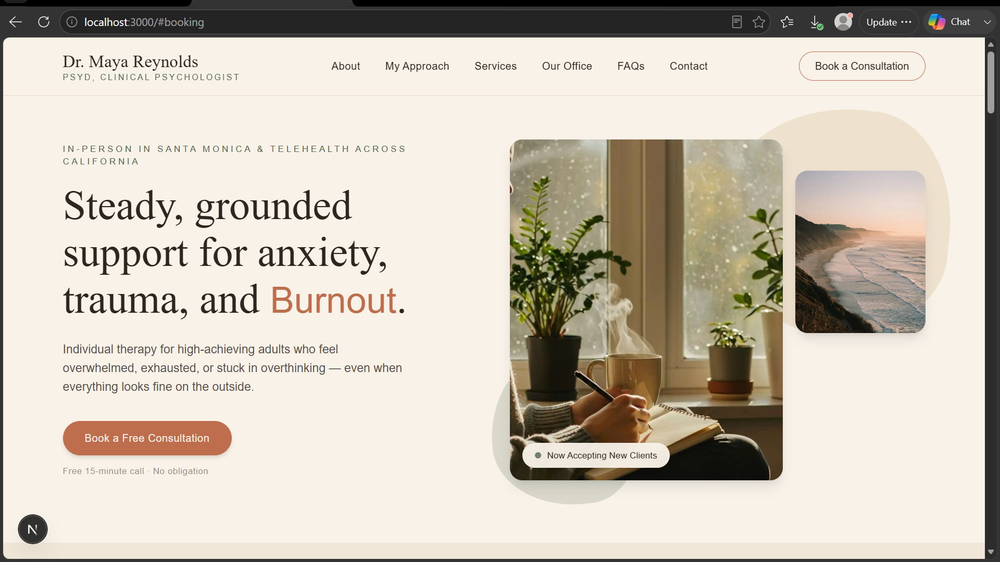
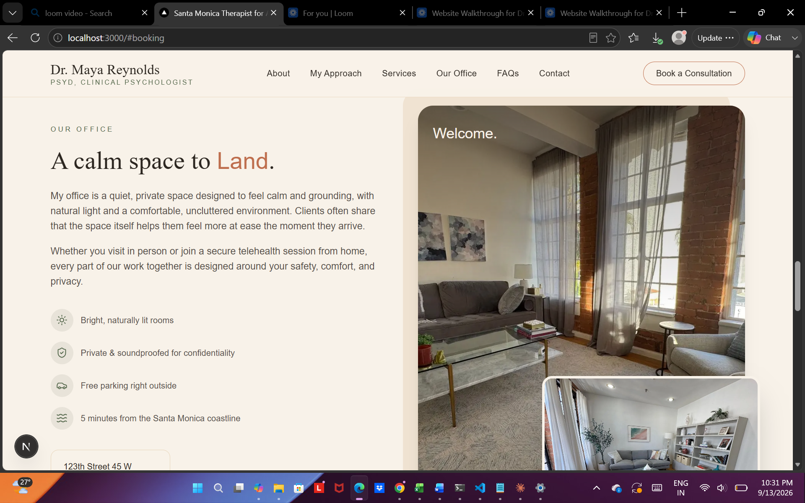

# Dr. Maya Reynolds — Healthcare Website

A modern, responsive healthcare website designed for Dr. Maya Reynolds, focused on building trust, presenting information clearly, and making it easy for patients to take the next step.

## Live Demo

https://dr-maya-reynolds-website-three.vercel.app/

## Screenshots

## 1



## 2

.


## Overview

This project is a first-draft website created for Dr. Maya Reynolds. The design focuses on presenting her professional profile, services, and key information in a clear and approachable way while keeping the overall experience simple for potential patients.

## Key Features

* Clean and professional healthcare-focused design
* Clear presentation of Dr. Maya Reynolds' profile and expertise
* Easy-to-find calls to action
* Responsive layout for different screen sizes
* Mobile-friendly navigation and content structure
* Clear sections for services and patient-focused information
* Accessible and easy-to-follow user experience

## Design Approach

The design was created with a focus on clarity, trust, and simplicity. Dr. Maya Reynolds' information was structured so that visitors can quickly understand who she is, what she offers, and how they can take the next step.

Visual hierarchy, spacing, typography, and calls to action were carefully considered to keep important information easy to find without overwhelming the visitor.

## Responsive Experience

The website was designed to provide a consistent experience across desktop and mobile devices. Content, navigation, images, and interactive elements adapt to smaller screens while maintaining readability and ease of use.

## Tech Stack

* Next.js
* React
* TypeScript
* CSS
* Vercel

## Getting Started

Clone the repository and install the dependencies:

```bash
git clone https://github.com/amal196/dr-maya-reynolds-website.git
cd dr-maya-reynolds-website
npm install
```

Run the development server:

```bash
npm run dev
```

Open `http://localhost:3000` in your browser to view the website.

---

Built as a website design and communication test for Dr. Maya Reynolds.
